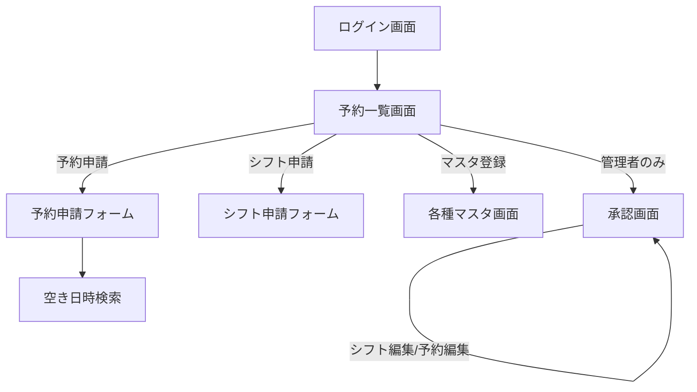

# ヘルプステーション シフト管理・予約管理システム 基本設計書

- 作成日: 2026-09-09
- 前提資料: [要件定義書](./要件定義書.md)（8章35項目中33件解決・2件保留の状態を前提とする）
- ステータス: ドラフト（レビュー前）

本書は要件定義書で解決済みとなった内容をもとに、画面・データベース・非機能面の設計をまとめたものである。要件定義書8.2（保留・未解決）に残る2件は、本書の該当箇所に「保留」として明記し、確定次第この基本設計書へ反映する。

## 1. システム構成

- クライアント: スマートフォン・タブレットのブラウザ（レスポンシブWebアプリケーション、要件定義書7章参照）
- サーバー: Webアプリケーションサーバー＋データベースサーバーの構成とする
- 通信: HTTPS
- ホスティング環境・冗長構成・バックアップ方式は未確定（要件定義書8.2項目2参照）

## 2. 画面一覧

| # | 画面名 | 対応するロール | 要件定義書 参照 |
|---|---|---|---|
| 1 | ログイン画面 | 全員 | 6.1 |
| 2 | 予約一覧画面（トップ画面） | 全員 | 6.3 |
| 3 | 予約申請フォーム | 職員・管理者 | 6.4.3 |
| 4 | 空き日時検索（3パターン） | 職員・管理者 | 6.4.2 |
| 5 | シフト申請フォーム | 職員・管理者 | 6.5.2 |
| 6 | 承認画面（シフト・予約共通） | 管理者のみ | 6.6 |
| 7 | 職員マスタ（一覧／登録・変更、削除なし） | 管理者のみ | 6.8.1 |
| 8 | 利用者マスタ（一覧／登録・変更、削除なし） | 管理者のみ | 6.8.2 |
| 9 | 支援内容マスタ（一覧／登録・変更・削除） | 管理者のみ | 6.8.3 |
| 10 | 車両マスタ（一覧／登録・変更、削除なし） | 管理者のみ | 6.8.4 |

## 3. 画面遷移

## 4. データベース設計

以下はテーブルの論理設計案である。要件定義書8.1で解決済みとなったDB関連項目（8.1項目13〜16等）を反映している。ER図としての正式化は別途行う。

### 4.1 職員（staff）

| カラム | 型 | 制約 | 備考 |
|---|---|---|---|
| id | INT | PK | |
| login_id | VARCHAR | UNIQUE, NOT NULL | ログイン認証用 |
| password_hash | VARCHAR | NOT NULL | |
| name | VARCHAR | NOT NULL | 氏名 |
| role | ENUM(社員, 管理) | NOT NULL | 3章のロール定義に対応 |
| annual_work_hour_limit | INT | NULL可 | 年間労働時間上限（時間） |
| failed_login_count | INT | NOT NULL | 連続ログイン失敗回数。5回で30分間ロックする（要件定義書8.1項目27参照） |
| last_failed_login_at | DATETIME | NULL可 | 直近のログイン失敗日時。ここから30分経過した失敗はカウントをリセットする |
| locked_until | DATETIME | NULL可 | ロック解除予定時刻。NULLはロックなし |
| created_at | DATETIME | NOT NULL | |
| updated_at | DATETIME | NOT NULL | |

### 4.2 職員デフォルト勤務時間（staff_default_schedule）

曜日ごとに1レコード（職員1人につき7レコード）。

| カラム | 型 | 制約 | 備考 |
|---|---|---|---|
| id | INT | PK | |
| staff_id | INT | FK → staff.id, NOT NULL | |
| day_of_week | TINYINT | 0〜6, NOT NULL | 日〜土 |
| is_am_off | BOOLEAN | NOT NULL | 午前休み（am_off・pm_off両方trueで終日休み） |
| is_pm_off | BOOLEAN | NOT NULL | 午後休み（am_off・pm_off両方trueで終日休み） |
| start_time | TIME | NULL可 | 始業時刻 |
| end_time | TIME | NULL可 | 終業時刻 |

### 4.3 利用者（client）

| カラム | 型 | 制約 | 備考 |
|---|---|---|---|
| id | INT | PK | |
| last_name | VARCHAR | NOT NULL | 苗字のみ（不正アクセス対策） |
| wheelchair_required | BOOLEAN | NOT NULL | 車いすの要否（電動／手動の区別は車両側で管理） |
| interval_unit | ENUM(日, 週, 月) | NULL可 | 利用間隔の単位。固定設定がない利用者向けの予約忘れ検出に使用（要件定義書8.1項目4参照） |
| interval_value | INT | NULL可 | 利用間隔の数値。「3」＋「月」で「3か月後」のように、前回予約日からの経過期間を表す |
| fixed_start_date | DATE | NULL可 | 固定（定期訪問）の開始日。終了日は持たず、開始日以降ずっと有効とする（要件定義書8.1項目21参照） |

デフォルト担当者・固定訪問の曜日はいずれも複数選択可のため、以下の中間テーブルで管理する。固定訪問の時刻は曜日ごとに異なりうるため、client_fixed_day_of_week側で保持する。

**利用者デフォルト担当者（client_default_staff）**

複合主キー：(client_id, staff_id)。

| カラム | 型 | 制約 | 備考 |
|---|---|---|---|
| client_id | INT | FK → client.id, NOT NULL | |
| staff_id | INT | FK → staff.id, NOT NULL | 複数登録可。予約申請フォームの担当者初期値として使用 |

**利用者固定訪問曜日（client_fixed_day_of_week）**

複合主キー：(client_id, day_of_week)。

| カラム | 型 | 制約 | 備考 |
|---|---|---|---|
| client_id | INT | FK → client.id, NOT NULL | |
| day_of_week | TINYINT | 0〜6, NOT NULL | 複数登録可。日〜土 |
| fixed_start_time | TIME | NOT NULL | 固定訪問の時刻（開始）。曜日ごとに設定 |
| fixed_end_time | TIME | NOT NULL | 固定訪問の時刻（終了）。曜日ごとに設定 |

### 4.4 支援内容（support_type）

| カラム | 型 | 制約 | 備考 |
|---|---|---|---|
| id | INT | PK | |
| name | VARCHAR | NOT NULL | 通院（病院）等 |
| dispatch_priority | INT | NOT NULL | 配車優先度。管理者が任意に設定・変更可能（要件定義書8.1項目12参照） |

### 4.5 車両（vehicle）

| カラム | 型 | 制約 | 備考 |
|---|---|---|---|
| id | INT | PK | |
| name | VARCHAR | NOT NULL | 例：車いす/電動1 |
| type | ENUM(介護専用車両_電動, 介護専用車両_手動, 普通社用車) | NOT NULL | 私用車はレコードを持たない（要件定義書8.1項目7参照） |
| is_unavailable | BOOLEAN | NOT NULL | 使用不可フラグ。点検・故障等で一時的に使用できない状態を示す。trueの間は空き判定の合算台数から除外する（要件定義書8.1項目28参照） |

### 4.6 シフト（shift）／シフト詳細（shift_detail）

shift は職員×対象月で1レコード、shift_detail は日ごとに1レコード。

**shift**

一意制約：(staff_id, target_year_month)の組み合わせは重複しない（職員×対象月で1レコード）。

| カラム | 型 | 制約 | 備考 |
|---|---|---|---|
| id | INT | PK | |
| staff_id | INT | FK → staff.id, NOT NULL | |
| target_year_month | CHAR(7) | NOT NULL | 例：2026-10 |
| submitted_at | DATETIME | NULL可 | 申請日時 |

**shift_detail**

一意制約：(shift_id, date)の組み合わせは重複しない（日ごとに1レコード）。

| カラム | 型 | 制約 | 備考 |
|---|---|---|---|
| id | INT | PK | |
| shift_id | INT | FK → shift.id, NOT NULL | |
| date | DATE | NOT NULL | |
| applied_start_time | TIME | NULL可 | 社員が申請した始業時刻 |
| applied_end_time | TIME | NULL可 | 社員が申請した終業時刻 |
| applied_am_off | BOOLEAN | NOT NULL | 休みの設定（午前休。終日休みはam_off・pm_off両方true） |
| applied_pm_off | BOOLEAN | NOT NULL | 休みの設定（午後休。終日休みはam_off・pm_off両方true） |
| applied_desired_off | BOOLEAN | NOT NULL | 希望休フラグ。休み自体の設定は上記am_off／pm_offで行い、本フラグはその休みが職員本人の希望によるものであることを示す |
| approval_flag | BOOLEAN | NOT NULL | 承認フラグ |
| admin_modified_flag | BOOLEAN | NOT NULL | 管理者が変更したか |
| modified_start_time | TIME | NULL可 | 管理者変更後の始業時刻 |
| modified_end_time | TIME | NULL可 | 管理者変更後の終業時刻 |
| modified_am_off | BOOLEAN | NOT NULL | 管理者変更後の午前休 |
| modified_pm_off | BOOLEAN | NOT NULL | 管理者変更後の午後休 |
| modified_approval_flag | BOOLEAN | NOT NULL | 管理者変更後の承認フラグ |

申請内容と管理者変更内容を別カラムで保持する設計とし、職員が申請した内容自体は保持されたまま、管理者による変更は別データとして記録する。画面上は、管理者変更があれば変更後の内容（確定内容）を表示し、変更があった旨を示す表示を行う。あわせて元の申請内容も参照できるようにする（要件定義書8.1項目11参照）。

### 4.7 予約（reservation）

| カラム | 型 | 制約 | 備考 |
|---|---|---|---|
| id | INT | PK | |
| client_id | INT | FK → client.id, NOT NULL | |
| date | DATE | NOT NULL | |
| start_time | TIME | NOT NULL | 「開始時刻＋終了時刻」方式（要件定義書8.1項目10参照） |
| end_time | TIME | NOT NULL | 「開始時刻＋終了時刻」方式（要件定義書8.1項目10参照） |
| support_type_id | INT | FK → support_type.id, NOT NULL | |
| vehicle_id | INT | FK → vehicle.id, NULL可 | 介護専用車両／普通社用車を選択し空きがある場合、配車優先度を参考にシステムが自動的に具体的な1台を決定し即時に設定する（電動・手動双方に空きがあれば電動を優先）。介護専用車両・普通社用車は別々の車両プールとして空き判定・優先度判定を行う（要件定義書8.1項目30参照）。後から優先度の高い予約が登録された際、既存予約のvehicle_idがシステムにより自動的に別の車両IDへ更新される場合がある（vehicle_reassigned_flag参照、要件定義書8.1項目31参照）。車不要・私用車の場合は常にNULL（要件定義書6.4.4参照） |
| vehicle_type_choice | ENUM(介護専用車両, 普通社用車, 私用車, 車不要) | NOT NULL | フォーム上の選択内容。私用車は車両マスタに存在しないため別カラムで保持 |
| remarks | TEXT | NULL可 | 備考（要件定義書8.1項目14参照） |
| status | ENUM(仮登録, 承認済み) | NOT NULL | 仮登録／承認済みの状態管理用（要件定義書8.1項目15参照） |
| vehicle_reassigned_flag | BOOLEAN | NOT NULL | 配車優先度判定によりシステムが自動的に車両を再割当したことを示す。予約一覧画面・承認画面での表示に使用する（要件定義書8.1項目31参照） |
| created_at | DATETIME | NOT NULL | |
| updated_at | DATETIME | NOT NULL | |

### 4.8 予約担当者（reservation_staff）

予約と職員の中間テーブル（多対多）。要件定義書8.1項目13参照（最重要事項）。一意制約：(reservation_id, staff_id)の組み合わせは重複しない（担当者未決定を表すstaff_id NULLの行は予約1件につき1行のみ登録する）。

| カラム | 型 | 制約 | 備考 |
|---|---|---|---|
| reservation_id | INT | FK → reservation.id, NOT NULL | |
| staff_id | INT | FK → staff.id, NULL可 | NULLの場合は「担当者未決定の予約」として承認画面に表示 |

### 4.9 監査ログ

DBテーブルとしては持たず、サーバ上のテキストファイルに出力する（アプリ内の閲覧画面は設けない、要件定義書8.1項目29参照）。1行1操作のログとして、以下の項目を出力する。保存期間はシフト・予約と同様に当年+3年分とする（要件定義書8.1項目32参照）。

| 項目 | 備考 |
|---|---|
| 日時 | |
| 職員ID | ログイン失敗時等はNULLの場合あり |
| 操作種別 | login/create/update/delete/approve 等 |
| 対象テーブル名 | |
| 対象レコードID | |
| 変更内容・登録内容・削除内容 | 削除時は削除されたレコードの内容を記録する（要件定義書8.1項目33参照） |
| IPアドレス | ログイン試行時のみ |

## 5. 機能仕様概要

各機能の詳細な業務ルールは要件定義書6章を正とし、本章では設計上のポイントのみ記載する。

- **配車優先度・車両空き判定**（要件定義書6.4.4参照）：介護専用車両は電動／手動を区別せず合算台数で空き判定を行うが、実際にどちらを割り当てるかは配車優先度を参考にシステムが自動で決定する（電動・手動双方に空きがあれば電動を優先）。普通社用車も同様に台数（3台）で空き判定を行う。**介護専用車両と普通社用車は別々の車両プールとして扱い、空き判定・優先度判定・再割当は車両種別ごとに独立して行う**（要件定義書8.1項目30参照）。配車優先度による車両の再割当（既存予約からの車両外し・付け替え）もシステムが自動で行うが、予約自体の日時・担当者調整は担当者が手動で行う。再割当された予約は担当者へアラート通知するとともに、vehicle_reassigned_flagにより予約一覧画面・承認画面でも表示する（要件定義書8.1項目31参照）。
- **シフト申請締切**（要件定義書8.1項目23参照）：自動仮登録・申請ロックは行わない。シフト申請フォームは対象月を選択でき、未申請の過去月にも常にアクセスできる。締切日は「シフト未申請アラート」「シフト未承認アラート」の通知タイミングを決めるためだけに使用する。
- **私用車の扱い**（要件定義書8.1項目7参照）：車両マスタには登録せず、reservation.vehicle_type_choice で管理する。
- **予約忘れ検知**（要件定義書8.1項目4参照）：固定（定期訪問）設定がある利用者は固定の曜日設定を検知に流用し、設定がない利用者は前回予約日から利用間隔（数値＋単位）で指定した期間経過後、新たな予約がなければ検知対象とする。

## 6. 非機能設計

要件定義書7章の非機能要件のうち、設計判断が必要な項目を記載する。未確定の項目は要件定義書8.2を参照。

| 項目 | 設計方針 |
|---|---|
| データ保持期間 | シフト・予約とも当年+3年分を保持。シフト・予約は職員・利用者・車両マスタを参照しているため、マスタを削除すると3年分の履歴を正しく参照できなくなる。この矛盾を避けるため、職員・利用者・車両マスタは削除機能を設けない（要件定義書8.1項目26参照）。監査ログも同様に当年+3年分を保持する（要件定義書8.1項目32参照） |
| バックアップ・可用性 | 未確定（要件定義書8.2項目2参照） |
| オフライン対応 | 今回のスコープ外（将来検討）。方式案：直近取得データのローカルキャッシュによる閲覧、フォーム入力の下書き自動保存（要件定義書8.1項目24参照） |
| 認証セキュリティ | 中程度のセキュリティとする。パスワードは最低8文字・英数字混在を推奨、強制定期変更なし。連続5回失敗でアカウントロック、30分後自動解除。セッションタイムアウトは8時間（要件定義書8.1項目27参照） |

## 7. 保留事項の引き継ぎ

要件定義書8.2に残る2件は、確定次第本書に反映する。
