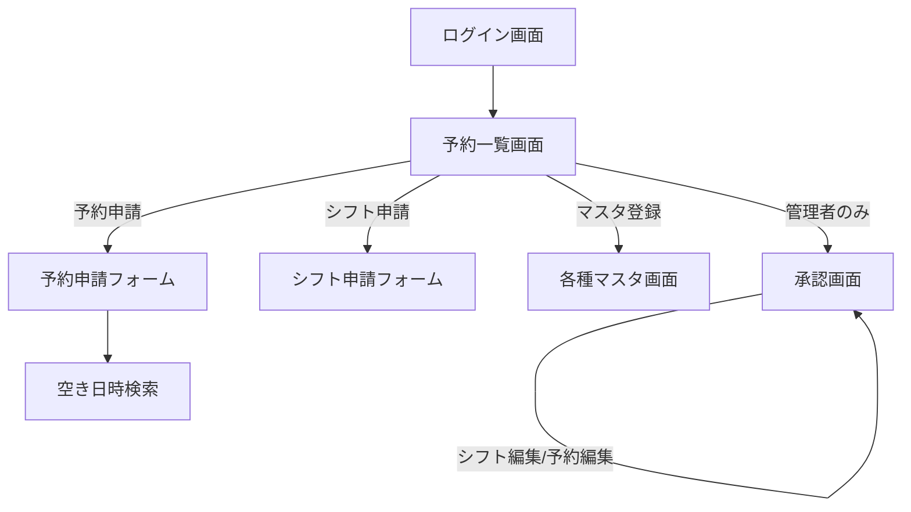

# ヘルプステーション シフト管理・予約管理システム 基本設計書

- 作成日: 2026-09-09
- 前提資料: [要件定義書](./要件定義書.md)（8章34項目中20件解決・14件保留の状態を前提とする）
- ステータス: ドラフト（レビュー前）

本書は要件定義書で解決済みとなった内容をもとに、画面・データベース・非機能面の設計をまとめたものである。要件定義書8.2（保留・未解決）に残る14件は、本書の該当箇所に「保留」として明記し、確定次第この基本設計書へ反映する。

## 1. システム構成

- クライアント: スマートフォン・タブレットのブラウザ（レスポンシブWebアプリケーション、要件定義書7章参照）
- サーバー: Webアプリケーションサーバー＋データベースサーバーの構成とする
- 通信: HTTPS
- ホスティング環境・冗長構成・バックアップ方式は未確定（要件定義書8.2項目7参照）

## 2. 画面一覧

| # | 画面名 | 対応するロール | 要件定義書 参照 |
|---|---|---|---|
| 1 | ログイン画面 | 全員 | 6.1 |
| 2 | 予約一覧画面（トップ画面） | 全員 | 6.3 |
| 3 | 予約申請フォーム | 職員・管理者 | 6.4.3 |
| 4 | 空き日時検索（3パターン） | 職員・管理者 | 6.4.2 |
| 5 | シフト申請フォーム | 職員・管理者 | 6.5.2 |
| 6 | 承認画面（シフト・予約共通） | 管理者のみ | 6.6 |
| 7 | 職員マスタ（一覧／登録・変更・削除） | 管理者のみ | 6.8.1 |
| 8 | 利用者マスタ（一覧／登録・変更・削除） | 管理者のみ | 6.8.2 |
| 9 | 支援内容マスタ（一覧／登録・変更・削除） | 管理者のみ | 6.8.3 |
| 10 | 車両マスタ（一覧／登録・変更・削除） | 管理者のみ | 6.8.4 |
| 11 | 監査ログ閲覧画面 | 未確定 | 要件定義書8.2項目14（保留） |

## 3. 画面遷移

## 4. データベース設計

以下はテーブルの論理設計案である。要件定義書8.1で解決済みとなったDB関連項目（項目18〜21等）を反映している。ER図としての正式化は別途行う。

### 4.1 職員（staff）

| カラム | 型 | 制約 | 備考 |
|---|---|---|---|
| id | INT | PK | |
| login_id | VARCHAR | UNIQUE, NOT NULL | ログイン認証用 |
| password_hash | VARCHAR | NOT NULL | |
| name | VARCHAR | NOT NULL | 氏名 |
| role | ENUM(社員, 管理) | NOT NULL | 3章のロール定義に対応 |
| annual_work_hour_limit | INT | NULL可 | 年間労働時間上限（時間） |
| created_at | DATETIME | NOT NULL | |
| updated_at | DATETIME | NOT NULL | |

### 4.2 職員デフォルト勤務時間（staff_default_schedule）

曜日ごとに1レコード（職員1人につき7レコード）。

| カラム | 型 | 制約 | 備考 |
|---|---|---|---|
| id | INT | PK | |
| staff_id | INT | FK → staff.id | |
| day_of_week | TINYINT | 0〜6 | 日〜土 |
| is_day_off | BOOLEAN | NOT NULL | 終日休みか |
| is_am_off | BOOLEAN | NOT NULL | 午前休み |
| is_pm_off | BOOLEAN | NOT NULL | 午後休み |
| start_time | TIME | NULL可 | 始業時刻 |
| end_time | TIME | NULL可 | 終業時刻 |

### 4.3 利用者（client）

| カラム | 型 | 制約 | 備考 |
|---|---|---|---|
| id | INT | PK | |
| last_name | VARCHAR | NOT NULL | 苗字のみ（不正アクセス対策） |
| wheelchair_required | BOOLEAN | NOT NULL | 車いすの要否（電動／手動の区別は車両側で管理） |
| interval_unit | ENUM(日, 週, 月) | NULL可 | 利用間隔の単位。予約忘れの検出、および固定（定期訪問）の間隔にも使用 |
| interval_value | INT | NULL可 | 利用間隔の数値 |

デフォルト担当者・固定訪問の曜日はいずれも複数選択可のため、以下の中間テーブルで管理する。固定訪問の時刻は曜日ごとに異なりうるため、client_fixed_day_of_week側で保持する。

**利用者デフォルト担当者（client_default_staff）**

| カラム | 型 | 制約 | 備考 |
|---|---|---|---|
| client_id | INT | FK → client.id | |
| staff_id | INT | FK → staff.id | 複数登録可。予約申請フォームの担当者初期値として使用 |

**利用者固定訪問曜日（client_fixed_day_of_week）**

| カラム | 型 | 制約 | 備考 |
|---|---|---|---|
| client_id | INT | FK → client.id | |
| day_of_week | TINYINT | 0〜6 | 複数登録可。日〜土 |
| fixed_start_time | TIME | NOT NULL | 固定訪問の時刻（開始）。曜日ごとに設定 |
| fixed_end_time | TIME | NOT NULL | 固定訪問の時刻（終了）。曜日ごとに設定 |

### 4.4 支援内容（support_type）

| カラム | 型 | 制約 | 備考 |
|---|---|---|---|
| id | INT | PK | |
| name | VARCHAR | NOT NULL | 通院（病院）等 |
| dispatch_priority | INT | NOT NULL | 配車優先度。管理者が任意に設定・変更可能（要件定義書8.1項目16） |

### 4.5 車両（vehicle）

| カラム | 型 | 制約 | 備考 |
|---|---|---|---|
| id | INT | PK | |
| name | VARCHAR | NOT NULL | 例：車いす/電動1 |
| type | ENUM(介護専用車両_電動, 介護専用車両_手動, 普通社用車) | NOT NULL | 私用車はレコードを持たない（要件定義書8.1項目9） |

### 4.6 シフト（shift）／シフト詳細（shift_detail）

shift は職員×対象月で1レコード、shift_detail は日ごとに1レコード。

**shift**

| カラム | 型 | 制約 | 備考 |
|---|---|---|---|
| id | INT | PK | |
| staff_id | INT | FK → staff.id | |
| target_year_month | CHAR(7) | NOT NULL | 例：2026-10 |
| submitted_at | DATETIME | NULL可 | 申請日時 |
| is_auto_generated | BOOLEAN | NOT NULL | 締切超過によるデフォルト勤務時間からの自動仮登録か（要件定義書8.2項目3、提案が確定次第使用） |

**shift_detail**

| カラム | 型 | 制約 | 備考 |
|---|---|---|---|
| id | INT | PK | |
| shift_id | INT | FK → shift.id | |
| date | DATE | NOT NULL | |
| applied_start_time | TIME | NULL可 | 社員が申請した始業時刻 |
| applied_end_time | TIME | NULL可 | 社員が申請した終業時刻 |
| applied_am_off | BOOLEAN | NOT NULL | 休みの設定（午前休。終日休みはam_off・pm_off両方true） |
| applied_pm_off | BOOLEAN | NOT NULL | 休みの設定（午後休。終日休みはam_off・pm_off両方true） |
| applied_desired_off | BOOLEAN | NOT NULL | 希望休フラグ。休み自体の設定は上記am_off／pm_offで行い、本フラグはその休みが職員本人の希望によるものであることを示す |
| approval_flag | BOOLEAN | NOT NULL | 承認フラグ |
| admin_modified_flag | BOOLEAN | NOT NULL | 管理者が変更したか |
| modified_start_time | TIME | NULL可 | 管理者変更後の始業時刻 |
| modified_end_time | TIME | NULL可 | 管理者変更後の終業時刻 |
| modified_am_off | BOOLEAN | NOT NULL | 管理者変更後の午前休 |
| modified_pm_off | BOOLEAN | NOT NULL | 管理者変更後の午後休 |
| modified_approval_flag | BOOLEAN | NOT NULL | 管理者変更後の承認フラグ |

申請内容と管理者変更内容を別カラムで保持する設計とし、職員が申請した内容自体は保持されたまま、管理者による変更は別データとして記録する（要件定義書8.1項目15、画面上の見せ方は別途確認）。

### 4.7 予約（reservation）

| カラム | 型 | 制約 | 備考 |
|---|---|---|---|
| id | INT | PK | |
| client_id | INT | FK → client.id | |
| date | DATE | NOT NULL | |
| start_time | TIME | NOT NULL | 「開始時刻＋終了時刻」方式（要件定義書8.1項目14） |
| end_time | TIME | NOT NULL | 「開始時刻＋終了時刻」方式（要件定義書8.1項目14） |
| support_type_id | INT | FK → support_type.id | |
| vehicle_id | INT | FK → vehicle.id, NULL可 | 介護専用車両／普通社用車を選択し空きがある場合、配車優先度を参考にシステムが自動的に具体的な1台を決定し即時に設定する（電動・手動双方に空きがあれば電動を優先）。車不要・私用車の場合は常にNULL（6.4.4参照） |
| vehicle_type_choice | ENUM(介護専用車両, 普通社用車, 私用車, 車不要) | NOT NULL | フォーム上の選択内容。私用車は車両マスタに存在しないため別カラムで保持 |
| remarks | TEXT | NULL可 | 備考（要件定義書8.1項目19で追加が確定） |
| status | ENUM(仮登録, 承認済み) | NOT NULL | 要件定義書8.1項目20で追加が確定 |
| created_at | DATETIME | NOT NULL | |
| updated_at | DATETIME | NOT NULL | |

### 4.8 予約担当者（reservation_staff）

予約と職員の中間テーブル（多対多）。要件定義書8.1項目18で確定した最重要事項。

| カラム | 型 | 制約 | 備考 |
|---|---|---|---|
| reservation_id | INT | FK → reservation.id | |
| staff_id | INT | FK → staff.id, NULL可 | NULLの場合は「担当者未決定の予約」として承認画面に表示 |

### 4.9 監査ログ（audit_log）

| カラム | 型 | 制約 | 備考 |
|---|---|---|---|
| id | INT | PK | |
| staff_id | INT | FK → staff.id, NULL可 | ログイン失敗時等はNULLの場合あり |
| action_type | VARCHAR | NOT NULL | login/create/update/delete/approve 等 |
| target_table | VARCHAR | NOT NULL | 対象テーブル名 |
| target_id | INT | NULL可 | 対象レコードID |
| detail | TEXT | NULL可 | 変更内容・登録内容 |
| ip_address | VARCHAR | NULL可 | ログイン試行時のみ |
| created_at | DATETIME | NOT NULL | |

閲覧画面の要否・仕様は未確定（要件定義書8.2項目14）。

## 5. 機能仕様概要

各機能の詳細な業務ルールは要件定義書6章を正とし、本章では設計上のポイントのみ記載する。

- **配車優先度・車両空き判定**（要件定義書6.4.4）：介護専用車両は電動／手動を区別せず合算台数で空き判定を行うが、実際にどちらを割り当てるかは配車優先度を参考にシステムが自動で決定する（電動・手動双方に空きがあれば電動を優先）。配車優先度による車両の再割当（既存予約からの車両外し・付け替え）もシステムが自動で行うが、予約自体の日時・担当者調整は担当者が手動で行う。
- **シフト締切超過時の自動仮登録**（要件定義書8.2項目3）：提案段階のため、確定後に shift.is_auto_generated 等の設計へ反映する。
- **私用車の扱い**（要件定義書8.1項目9）：車両マスタには登録せず、reservation.vehicle_type_choice で管理する。

## 6. 非機能設計

要件定義書7章の非機能要件のうち、設計判断が必要な項目を記載する。未確定の項目は要件定義書8.2を参照。

| 項目 | 設計方針 |
|---|---|
| データ保持期間 | シフト・予約とも当年+3年分を保持。マスタ削除時の扱いは未確定（要件定義書8.2項目6） |
| バックアップ・可用性 | 未確定（要件定義書8.2項目7） |
| オフライン対応 | 未確定（要件定義書8.2項目8） |
| 認証セキュリティ | アカウントロックアウト・パスワードポリシー等は未確定（要件定義書8.2項目9） |

## 7. 保留事項の引き継ぎ

要件定義書8.2に残る14件は、確定次第本書に反映する。特に以下は基本設計に直接影響するため優先的に解消する。

- 項目3：シフト締切超過時の自動仮登録の是非（shiftテーブルの設計に影響）
- 項目6：マスタ削除時のデータ整合性（論理削除／物理削除の方針）
- 項目13：車両の点検中・故障中等の一時的な稼働停止状態の扱い（vehicleテーブルへのステータス追加要否）
- 項目14：監査ログ閲覧画面の要否・仕様
